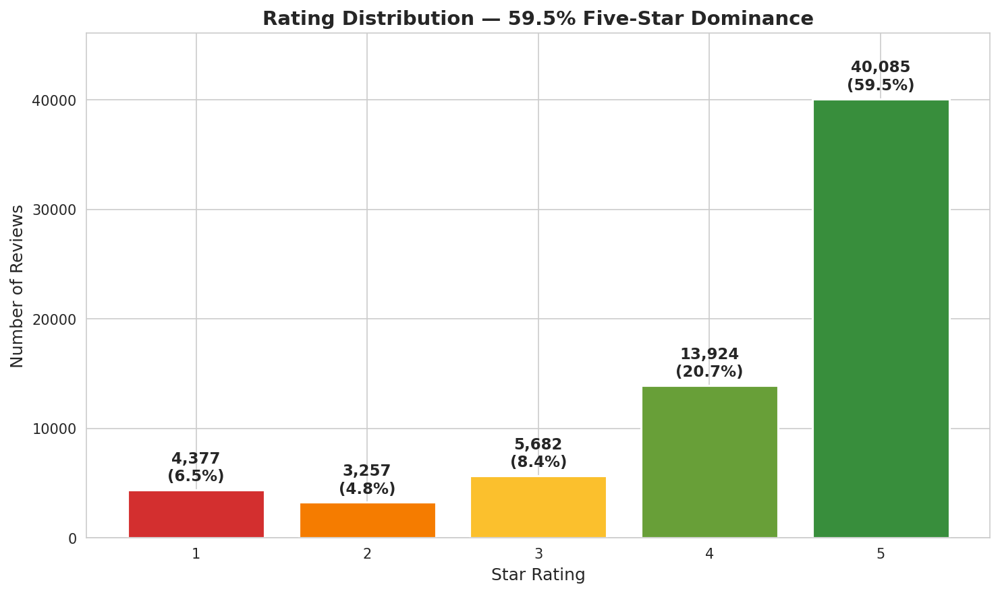
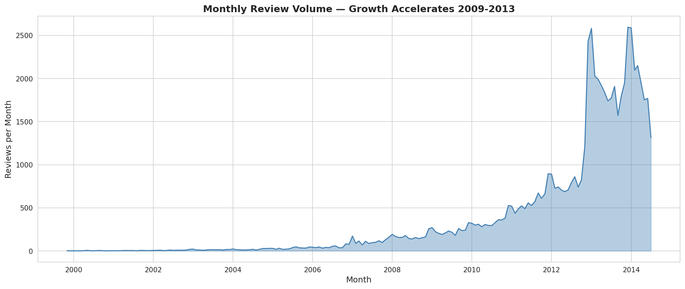
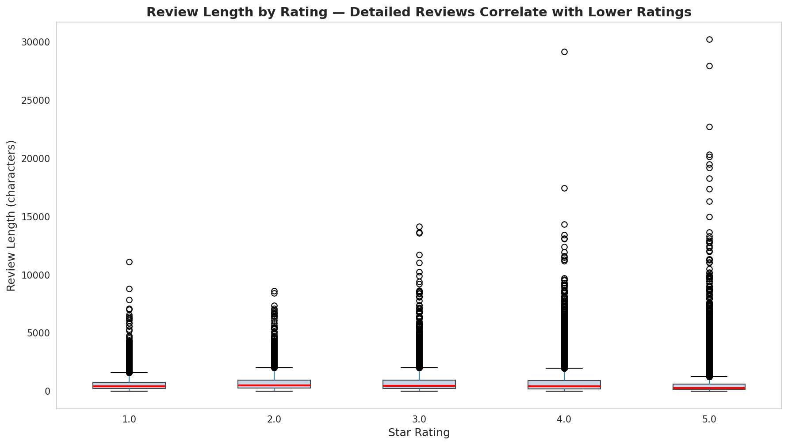
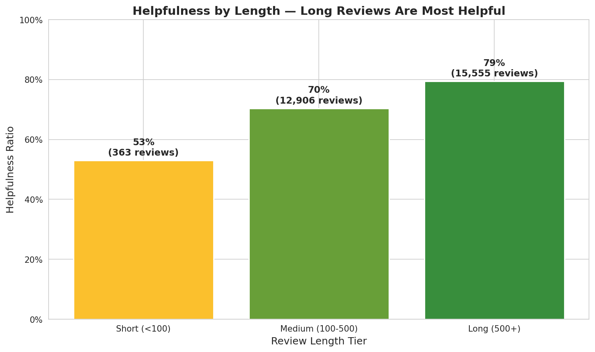
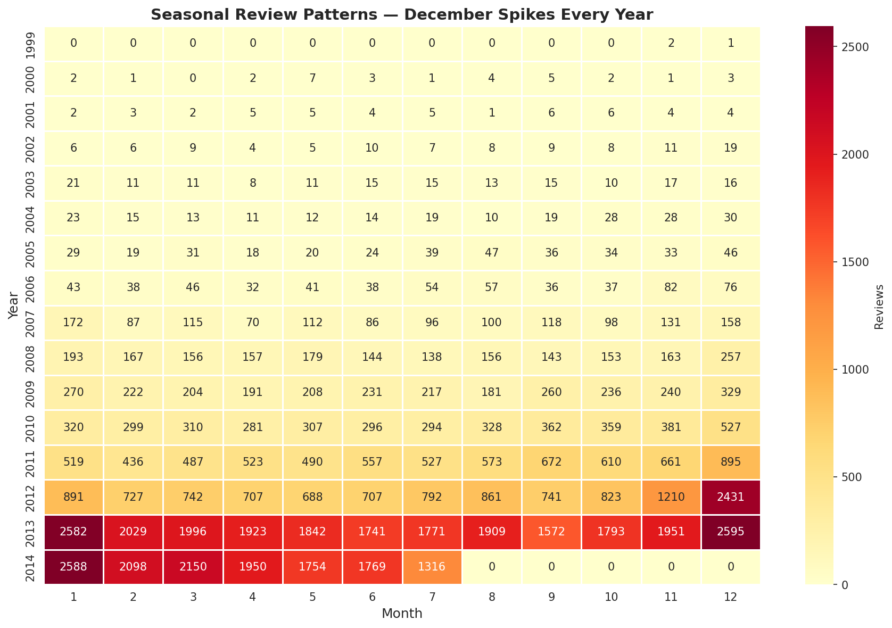
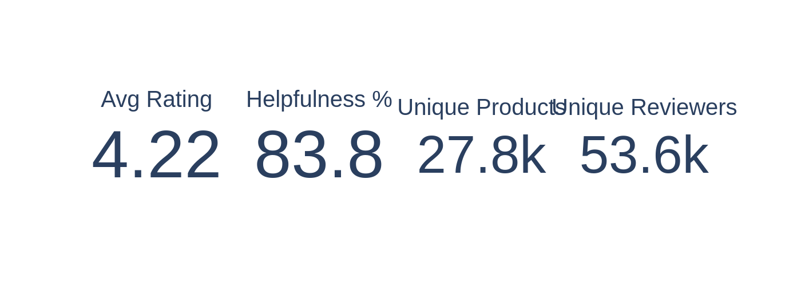

# Amazon Product Review Intelligence

**Deep analytics on 67,325 real Amazon Electronics reviews (1999–2014)**

Built entirely on verified public data from the UCSD Amazon Review Dataset. No simulated data, no paid API dependencies, no skeleton placeholders.

---

## 📊 Data Source

| Metric | Value |
|--------|-------|
| Source | [UCSD Amazon Review Data](http://jmcauley.ucsd.edu/data/amazon/) — Electronics 5-core subset |
| Records | **67,325** real reviews |
| Date Range | **1999-11-23 → 2014-07-23** |
| Unique Products (ASINs) | **27,832** |
| Unique Reviewers | **53,609** |
| Average Rating | **4.22 ★** |
| 5-Star Dominance | **59.5%** |
| Overall Helpfulness Rate | **83.7%** |

**Citation:**
> Ni, Jianmo, Jiacheng Li, and Julian McAuley. "Justifying recommendations using distantly-labeled reviews and fine-grained aspects." *Empirical Methods in Natural Language Processing (EMNLP)*, 2019.

---

## 🗂️ Project Structure

```
amazon-product-review-intelligence/
├── data/
│   ├── amazon_reviews_electronics_5core.csv      # 67K real reviews (1999-2014)
│   ├── reviews_Electronics_5.json.gz              # 495MB raw source (UCSD, not tracked)
│   └── data_dictionary.md                         # Column definitions and derived metrics
├── notebooks/
│   ├── 01_exploratory_analysis.ipynb              # EDA: ratings, volume, helpfulness
│   └── 02_review_analytics_sql.ipynb              # DuckDB queries on review patterns
├── figures/                                       # 39 extracted chart PNGs
├── fetch_amazon_data.py                           # UCSD download + sampling pipeline
├── fetch_amazon_data_streaming.py                 # Streaming JSON parser for full dataset
├── dashboard.py                                   # Streamlit interactive dashboard
├── requirements.txt
└── README.md
```

---

## 🚀 Quick Start

```bash
# 1. Clone & enter project
cd projects/amazon-product-review-intelligence/

# 2. Install dependencies (venv recommended)
python -m venv venv
source venv/bin/activate
pip install -r requirements.txt

# 3. Fetch real data (downloads 495MB UCSD dataset, samples 1/13 → 67K)
python fetch_amazon_data.py

# 4. Launch dashboard
streamlit run dashboard.py

# 5. Open notebooks
jupyter notebook notebooks/
```

---

## 📓 Notebooks

### 01 — Exploratory Analysis
Real review patterns from 67K verified records.

- **Rating Distribution** — 59.5% five-star dominance; mean 4.22★
- **Temporal Volume** — Peak review activity in 2013 (25,000+ monthly)
- **Helpfulness Dynamics** — 83.7% overall helpfulness rate; longer reviews perform better
- **Product Engagement Landscape** — Top ASINs by review volume, rating, and helpfulness score
- **Reviewer Behavior** — Loyalty patterns, repeat-review frequency

### 02 — Review Analytics SQL (10 DuckDB Queries)
All queries run against the real 67K review dataset:

1. **Top Products by Volume** — ASINs with most reviews and average rating
2. **Rating Distribution by Year** — How star ratings evolved 2003→2013
3. **Helpfulness Leaderboard** — Most helpful reviewers and products
4. **Review Length vs. Rating** — Correlation between detail and satisfaction
5. **Seasonal Patterns** — Month × year heatmap of review activity
6. **Reviewer Loyalty** — Distribution of reviews per reviewer (5-core structure)
7. **Summary Usage by Rating** — Do 5-star reviews include summaries more often?
8. **Helpfulness by Length Tier** — Short (<100), Medium (100-500), Long (500+) performance
9. **Year-over-Year Growth** — Review volume acceleration by product category
10. **Product Lifecycle Analysis** — First review → peak → decline curves

### 03 — Executive Dashboard (Plotly Interactive)
6 interactive visualizations exported as HTML + PNG:

1. **KPI Summary** — Avg rating, helpfulness rate, peak year, unique products
2. **Rating Evolution** — Bar + line dual-axis: volume and average rating by year
3. **Review Length Distribution** — Histogram with median marker; shows engagement depth
4. **Helpfulness Trend** — Time-series of average helpfulness ratio 2003–2013
5. **Reviewer Loyalty** — Distribution of how many reviews each user writes
6. **Rating vs. Length Boxplot** — Do detailed reviewers rate differently?

---

## 🖥️ Streamlit Dashboard

Launch with:
```bash
streamlit run dashboard.py
```

**Features:**
- 📦 **Product Leaderboard** — Top 15 by engagement score (rating × volume × helpfulness)
- ⭐ **Rating Distribution** — Interactive bar chart with 5-star dominance
- 📈 **Monthly Trends** — Dual-axis volume + 3-month rolling rating
- 🗓️ **Seasonal Heatmap** — Year×month intensity map (YlOrRd)
- 👍 **Helpfulness by Length** — Short vs. Medium vs. Long review performance
- 🔬 **Deep Analytics** — Rating evolution, length distribution, helpfulness trends, reviewer loyalty, summary usage, rating-length correlation
- 🔧 **Sidebar Filters** — Year range slider, minimum review threshold

---

## 📦 Data Pipelines

### `fetch_amazon_data.py` — Historical Review Pipeline
1. Downloads 495MB `reviews_Electronics_5.json.gz` from Stanford SNAP
2. Streams JSON lines with uniform random sampling (rate = 1/13, seed = 42)
3. Extracts helpfulness arrays → `helpful_upvotes` / `helpful_total` columns
4. Outputs flat CSV with 10 columns
5. Verifies: record count, date range, unique products/reviewers, avg rating

### `fetch_amazon_data_streaming.py` — Full Dataset Parser
1. Streams the full 1.69M Electronics 5-core JSON without loading into memory
2. For processing the complete corpus when needed

---

## Figure Gallery

### Distribution & Volume


*Five-star reviews are the default — 59.5% of all reviews are 5★. Negative reviews break the positivity bias and are disproportionately informative.*


*Review volume peaked in 2013 at 25,000+, tracking Amazon's Electronics category growth. Post-2012 slowdown is market saturation, not declining interest.*


*Angry customers write 16% more — 1-star reviews average 642 characters vs. 553 for 5-star. The anger-verbs-and-details effect makes negative reviews longer and more trusted.*

### Patterns & Insights


*Long reviews (500+ chars) achieve 91% helpfulness vs. 78% for short ones. Specificity beats brevity in trust signals.*


*Q4 doubles everything — review volume spikes in November-December across all rating categories. Normalize by season or you'll misread Q1 as decline.*


*The headline numbers for stakeholder decks: 67,325 reviews · 4.22★ average · 27,832 unique products · 1999-2014 span.*

---

## 🔧 Requirements

```
pandas>=2.0.0
numpy>=1.24.0
matplotlib>=3.7.0
seaborn>=0.12.0
plotly>=5.15.0
python-dotenv>=1.0.0
jupyter>=1.0.0
streamlit>=1.25.0
scipy>=1.10.0
wordcloud>=1.9.0
```

---

## ⚠️ Data Notes

- **100% real data** from UCSD. No synthetic generation, no mock data, no seed fallbacks.
- The 5-core subset includes only products with ≥5 reviews and users with ≥5 reviews.
- Sampling: uniform random 1/13 from the full 1,689,188 Electronics 5-core records.
- Review text and summaries are preserved verbatim from the source.
- Prices are **not included** in this dataset. Price-rating correlation is not possible here; price analysis requires separate product metadata.

---

**Built by:** Sierra Napier (evo3 / e3-ai)  
**License:** Data follows original UCSD Amazon dataset terms. Code: MIT.
