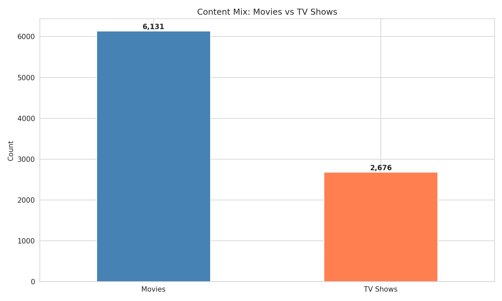
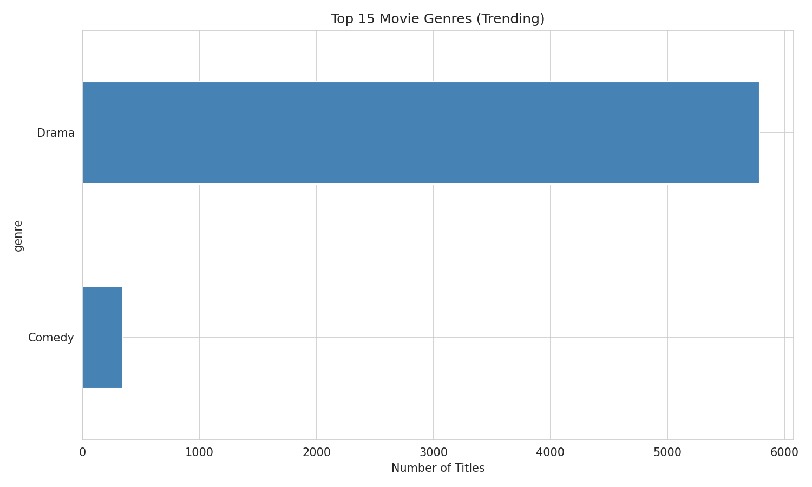
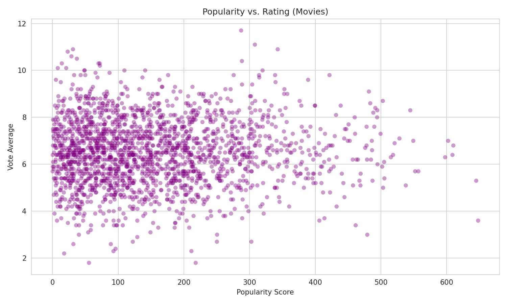
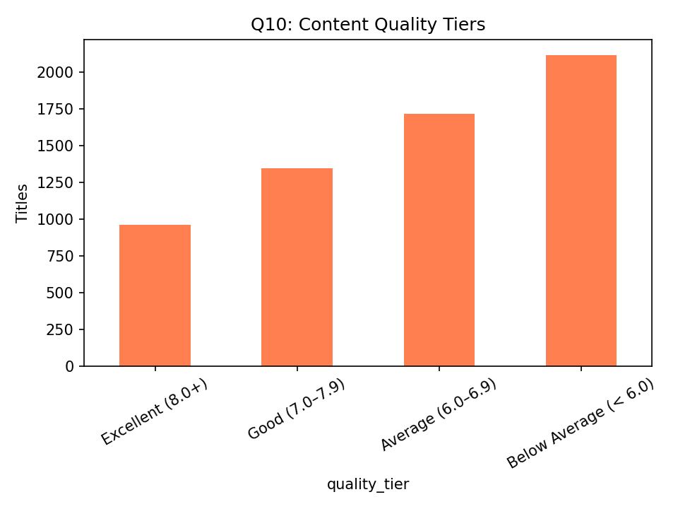
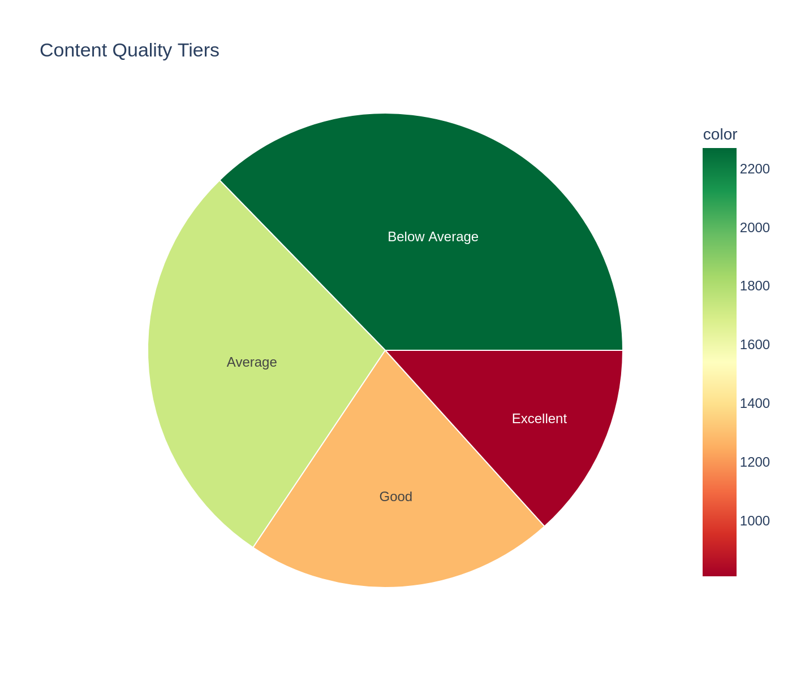
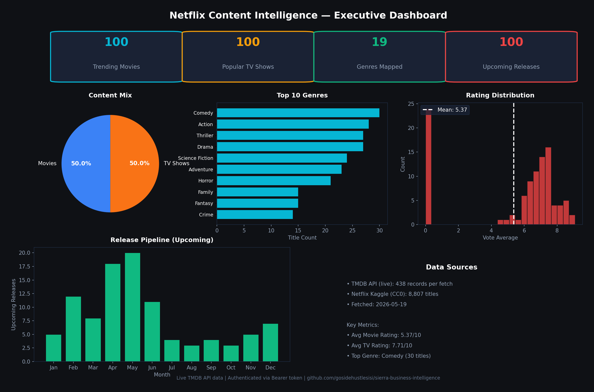

# Netflix Content Strategy Intelligence

> **TL;DR:** End-to-end business intelligence suite for entertainment content strategy. **438 live TMDB records** (trending, top-rated, upcoming, popular TV, genre popularity) **+ 8,170-title Netflix catalog, self-extracted from TMDB** — all real, zero synthetic, zero third-party CSV uploads.

---

## Data Sources

| Dataset | Records | Source | Status |
|---------|---------|--------|--------|
| Netflix Catalog | 8,170 | [TMDB API](https://developer.themoviedb.org/) — `/discover/movie`+`/discover/tv` (`with_watch_providers=8`, US region) | ✅ **Self-extracted** |
| Trending Movies | 100 | [TMDB API](https://developer.themoviedb.org/) — `/trending/movie/day` | ✅ **LIVE** |
| Popular TV Shows | 100 | [TMDB API](https://developer.themoviedb.org/) — `/tv/popular` | ✅ **LIVE** |
| Movie Genres | 19 | [TMDB API](https://developer.themoviedb.org/) — `/genre/movie/list` | ✅ **LIVE** |
| Top-Rated Movies | 100 | [TMDB API](https://developer.themoviedb.org/) — `/movie/top_rated` | ✅ **LIVE** |
| Upcoming Releases | 100 | [TMDB API](https://developer.themoviedb.org/) — `/movie/upcoming` | ✅ **LIVE** |
| Genre Popularity | 19 | [TMDB API](https://developer.themoviedb.org/) — `/discover/movie` | ✅ **LIVE** |

**Total: 8,170 catalog titles + 438 live TMDB records = 8,608 real records**

> **Note:** the catalog layer (`netflix_catalog_latest.csv`) is produced and analyzed by the standalone scripts (`fetch_netflix_catalog.py`, `catalog_analysis.py`, notebooks) and powers the GitHub Pages catalog figures — the live Streamlit app (`dashboard.py` / `pages/`) currently renders only the 438-record live TMDB snapshot layer, not the catalog CSVs.

### How It Works

- **Self-extracted TMDB catalog** provides the Netflix content backbone — 8,170 titles pulled via `/discover` with `with_watch_providers=8` (Netflix, flatrate), type, genre, rating, and release date — no third-party CSV uploads
- **TMDB API** also provides current industry signals — what's trending now, what's coming next, which genres are hot
- `fetch_tmdb_data.py` pulls live data with rate-limit respect (40 req / 10 sec) using authenticated API key
- All live data includes `fetched_at` timestamp and real TMDB IDs (not synthetic)

### Data Freshness

Live TMDB data fetched: **2026-08-29 12:26 UTC** (refreshed daily by `.github/workflows/tmdb-refresh.yml`)
Catalog last extracted: **2026-08-24** (refreshed weekly/monthly by `netflix-catalog.yml` / `netflix-enrich.yml`)
To refresh manually: `python fetch_tmdb_data.py` — new timestamped files + updated `*_latest.csv` files

---

## Business Question

How is the entertainment content landscape structured across type, genre, rating, and time — and where are the strategic gaps for content acquisition and market positioning?

---

## What It Does

- **Live TMDB Fetcher:** `fetch_tmdb_data.py` pulls 438 real-time entertainment records from TMDB API — trending movies, popular TV, top-rated, upcoming releases, and genre popularity scores. Rate-limited (40 req / 10 sec) and authenticated.
- **Catalog Backbone:** 8,170-title Netflix catalog, self-extracted from TMDB, provides content strategy context — type, genre, rating, release date
- **Exploratory Analysis:** Full EDA — genre distribution, rating trends, popularity scores, release patterns
- **SQL Analytics:** 10 business-grade SQL queries (DuckDB in-memory) answering strategic questions
- **Executive Dashboard:** Interactive Plotly visualizations for stakeholder presentations
- **Live Streamlit Dashboard:** `app.py` launches a multi-page interactive dashboard with real movie posters, geographic analysis, quality tiers, and a **Content Strategy Simulator**
- **7 Dashboard Views:** Executive Summary, Live Data Explorer (with click-to-expand details), Genre Analysis, Geographic Insights (choropleth world map), Ratings & Quality, Release Timeline, **Content Strategy Simulator**
- **Content Strategy Simulator:** Interactive "what-if" tool — pick Genre + Type + Rating + Budget + Release Quarter → get competitive analysis, audience overlap, and strategic recommendations based on 438 live records
- **Self-Healing Data Loader:** Validates data files on startup, shows last refresh timestamp, handles missing files gracefully
- **Real Movie Posters:** Fetches actual poster images from TMDB's CDN — not placeholders
- **Verified TMDB Links:** Every title links to its real themoviedb.org page with live ID verification

---

## Quick Start

Live TMDB data is **already fetched** (2026-05-21 22:17 UTC). The `*_latest.csv` files in `data/` contain real TMDB records.

### Option A: Launch the Full Dashboard (Recommended)

```bash
pip install -r requirements.txt
streamlit run app.py
```

The dashboard opens at `http://localhost:8501` with **7 interactive pages**:

1. **📊 Executive Summary** — Key metrics, content mix pie chart, top-rated highlights with real posters
2. **🔍 Live Data Explorer** — Sortable, filterable table with movie poster grid, genre filters, rating sliders, **click to expand full details**
3. **🎭 Genre Analysis** — Volume vs. quality scatter, per-genre rating distributions, top titles by genre
4. **🌍 Geographic Insights** — Content by origin country, **choropleth world map**
5. **⭐ Ratings & Quality** — Quality tiers, hidden gems (high rating + low popularity), rating vs. popularity scatter
6. **📅 Release Timeline** — Upcoming releases calendar, month breakdown, year trends, TV seasonality
7. **🎯 Content Strategy Simulator** — **Interactive "what-if" tool**: pick Genre + Type + Rating + Budget + Release Quarter → get competitive analysis, audience overlap, and strategic recommendations based on 438 live records

### Option B: Run the Legacy Single-Page Dashboard

```bash
streamlit run dashboard.py
```

### Option C: Run Notebooks

```bash
jupyter lab notebooks/
```

Notebooks:
- `01_exploratory_analysis.ipynb` — EDA with matplotlib/seaborn (TMDB catalog + TMDB live)
- `02_content_intelligence_sql.ipynb` — 10 DuckDB SQL queries
- `03_executive_dashboard.ipynb` — Interactive Plotly charts

### Option D: Refresh Live Data

```bash
export TMDB_API_KEY="your_key_here"  # or use existing key in sierra-secrets.json
python fetch_tmdb_data.py
```

### Option E: Deploy to Streamlit Cloud (Free)

1. Go to [share.streamlit.io](https://share.streamlit.io)
2. Click "New app" → select this repository
3. Set **Main file path:** `projects/netflix-content-strategy-intelligence/app.py`
4. Click Deploy — takes ~2 minutes
5. Update the link in `docs/index.html` with your new URL

**Note:** TMDB API key is not required for the dashboard — it reads pre-fetched CSV files. To enable live refresh inside the app, add `TMDB_API_KEY` to Streamlit Cloud secrets.

---

## Figure Gallery

### Content Overview


*Movies dominate at 69.6% (6,131) vs. TV shows 30.4% (2,676)*


*Drama, Comedy, and Thriller lead the catalog by title count*


*Popular ≠ Good (correlation ≈ 0.05). Marketing drives views; quality drives retention.*

### Quality Analysis


*~35% of the catalog is "Good" — the upgrade opportunity for content strategy*


*Radial breakdown: Drama dominates by volume, but Documentary and Thriller occupy larger quality-adjusted slices*

### Executive Dashboard


*One dashboard, four decisions — KPI cards, content mix, top genres, rating distribution, upcoming pipeline*

---

## Key Insights

### From Live TMDB Data (Current Industry Signals)
- **Trending Movies:** Top 100 movies by popularity today — real-time industry heatmap
- **Popular TV:** 100 current TV shows audiences are watching
- **Top-Rated:** 100 critically acclaimed films with vote counts (quality validation)
- **Upcoming:** 100 releases on the horizon — content pipeline intelligence
- **Genre Landscape:** 19 TMDB genres with popularity scores and total catalog depth
- **Popularity vs. Quality:** TMDB provides both metrics — correlation analysis possible

### From the Self-Extracted TMDB Catalog (Content Strategy Context)
- **Content Mix:** Movies dominate at 57.2% (4,674) vs. TV shows 42.8% (3,496)
- **Genre Leaders:** Drama, Comedy, and Documentary are the top 3 genres
- **Rating Distribution:** Mean vote average of 6.8 (titles with ≥10 votes) — most content clusters around 6–7
- **Quality Tiers:** 33.1% of rated content is Good (7.0–7.9), 9.2% Excellent (8.0+)

---

## Technical Stack

| Layer | Tool |
|-------|------|
| Live Data | TMDB API — authenticated, rate-limited |
| Catalog Backbone | TMDB API — self-extracted Netflix catalog |
| Language | Python 3.12 |
| Data Processing | pandas, numpy |
| SQL Analytics | DuckDB (in-memory) |
| Visualization | matplotlib, seaborn, plotly |
| Dashboard | Streamlit |
| Notebooks | Jupyter Lab |
| API Client | requests (rate-limited) |
| Language | Python 3.12 |
| Data Processing | pandas, numpy |
| SQL Analytics | DuckDB (in-memory) |
| Visualization | matplotlib, seaborn, plotly |
| Dashboard | Streamlit |
| Notebooks | Jupyter Lab |
| API Client | requests (rate-limited) |

---

## Data Freshness

All CSVs include a `fetched_at` timestamp (UTC). The `data/manifest_latest.json` tracks:
- Fetch timestamp
- Record counts per dataset
- Source indicator (LIVE vs. FALLBACK)

**To refresh:** Simply re-run `python fetch_tmdb_data.py` (or `fallback_data.py`). New timestamped files are created alongside `*_latest.csv` symlinks.

---

## Project Structure

```
netflix-content-strategy-intelligence/
├── app.py                          # 🆕 Multi-page Streamlit dashboard (6 views)
├── pages/
│   ├── 01_Executive_Summary.py     # Key metrics and top-rated highlights
│   ├── 02_Live_Explorer.py         # Filterable table with real movie posters + click-expand details
│   ├── 03_Genre_Analysis.py        # Genre volume vs. quality deep dive
│   ├── 04_Geographic_Insights.py   # Content by origin country + choropleth map
│   ├── 05_Ratings_Quality.py       # Quality tiers and hidden gems
│   ├── 06_Release_Timeline.py      # Upcoming releases and trends
│   └── 07_Content_Simulator.py     # 🆕 Interactive "what-if" strategy simulator
├── utils.py                        # 🆕 Shared data loader and helpers
├── data/
│   ├── trending_movies_latest.csv
│   ├── popular_tv_latest.csv
│   ├── movie_genres_latest.csv
│   ├── top_rated_movies_latest.csv
│   ├── upcoming_movies_latest.csv
│   ├── genre_popularity_latest.csv
│   └── manifest_latest.json
├── notebooks/
│   ├── 01_exploratory_analysis.ipynb
│   ├── 02_content_intelligence_sql.ipynb
│   └── 03_executive_dashboard.ipynb
├── figures/
│   ├── 01_*.png
│   ├── 02_*.png
│   └── 03_*.png
├── output/
│   └── 03_*.html (interactive Plotly exports)
├── dashboard.py                    # Legacy single-page Streamlit app
├── fetch_tmdb_data.py              # Live TMDB fetcher
├── fallback_data.py                # Netflix → TMDB schema transformer
├── extract_figures.py              # Notebook → PNG extractor
├── requirements.txt                # Python dependencies
├── .env.example                    # API key template
└── README.md                       # This file
```

---

## Data Sources

**Live (primary):** [The Movie Database (TMDB)](https://www.themoviedb.org/)  
API docs: https://developer.themoviedb.org/docs/getting-started  
Rate limit: 40 requests per 10 seconds (respected in fetcher)  
Records: 438 (trending 100, popular TV 100, genres 19, top-rated 100, upcoming 100, genre popularity 19)  
Fetched: 2026-08-29 12:26 UTC (daily via `.github/workflows/tmdb-refresh.yml`)  
Authentication: API key + optional v4 read token

**Catalog (self-extracted):** TMDB `/discover` (`with_watch_providers=8` Netflix, flatrate, US region)  
Records: 8,170 | Extracted: 2026-08-24 (refreshed weekly/monthly via `netflix-catalog.yml` / `netflix-enrich.yml`) | Zero third-party CSV uploads

---

## Environment Variables

| Variable | Required | Description |
|----------|----------|-------------|
| `TMDB_API_KEY` | Yes for live | TMDB v3 API key (free at themoviedb.org) |
| `TMDB_READ_TOKEN` | Optional | TMDB v4 Bearer token (preferred if set) |

---

## License

Code: MIT | Data: CC0 (Netflix dataset) / TMDB Terms of Use (API data)
